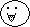
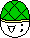
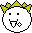
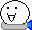
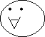
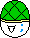
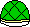
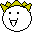

---
title: Jisaku Jien
layout: syobonkz_wiki_page
filename: evil_cloud.md
--- 

# Jisaku Jien

<table align="right">
  <tr>
    <th colspan="2">Jisaku Jien</th>
  </tr>
  <tr>
    <td>Sprite</td>
    <td>
      
      
      
      
      
    </td>
  </tr>
  <tr>
    <td>First appearance</td>
    <td>Syobon Action</td>
  </tr>
</table>

Syobon Action enemy, appears since the original game.

It is based on [Jisaku Jien](https://namelessrumia.heliohost.org/w/doku.php?id=jisaku_jien) 2ch character, which has Molalla's face

In code comments it's named "Enemy", "Shell Enemy" or "Super Jien", people also just call it "Goomba"

## Behavior

The normal one and the rocket one will die when stomped, the shell one will become a shell that you can kick to kill other enemies, the super one and the big one can NOT be stomped.

When the normal or super jien touch a mushroom, they become the big one

## Sprites

|State/Type|Sprite|
|-----|------|
|Normal ||
|Shell||
|Shell (Super Syobon)||
|Shell (Stomped)||
|Super Jien||
|Super Jien (Super Syobon)||
|Rocket||
|Big||

## Messages

* TODO
