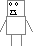
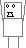
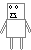
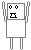

---
title: Defrag-san
layout: syobonkz_wiki_page
filename: defrag.md
--- 

# Defrag-san

<table align="right">
  <tr>
    <th colspan="2">Defrag-san</th>
  </tr>
  <tr>
    <td>Sprite</td>
    <td>
      
    </td>
  </tr>
  <tr>
    <td>First appearance</td>
    <td>Syobon Action</td>
  </tr>
</table>

Syobon Action enemy, appears since the original game.

It is based on [Defrag-san](https://web.archive.org/web/20260316054641/https://namelessrumia.heliohost.org/w/doku.php?id=defrag-san) 2ch character, which was usually used for art where he fixes text artworks or malformed words.

In code comments it's named "Defrag-san", it is also known as just "Defrag".

## Behavior

When the player touches it, Defrag will grab the player and throw it to the right.

## Sprites

|State/Type|Sprite|
|-----|------|
|Normal||
|Holding||
|Normal (Super Syobon)||
|Holding (Super Syobon)||

## Messages

This enemy does not have taunts
