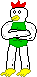

---
title: Kukkuru
layout: syobonkz_wiki_page
filename: kukkuru.md
--- 

# Kukkuru

<table align="right">
  <tr>
    <th colspan="2">Kukkuru</th>
  </tr>
  <tr>
    <td>Sprite</td>
    <td>
      
    </td>
  </tr>
  <tr>
    <td>First appearance</td>
    <td>Syobon Action</td>
  </tr>
</table>

Syobon Action enemy, appears since the original game.

It is based on [Kukkuru](https://namelessrumia.heliohost.org/w/doku.php?id=kukkuru) 2ch character, which fights other 2ch characters and then take them to Area 51, which may explain why in Syobon Action Level 1-4 there is a pipe with number 51 in it

In code comments it's named "Kukkuru"

## Behavior

He does not move, but will kill syobon when touched.

## Sprites

|State/Type|Sprite|
|-----|------|
|Normal ||

## Messages

* ```？```

## Trivia

* This enemy is missing in Super Syobon
