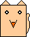
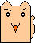

---
title: Nyassun
layout: syobonkz_wiki_page
filename: nyassun.md
--- 

# Nyassun

<table align="right">
  <tr>
    <th colspan="2">Nyassun</th>
  </tr>
  <tr>
    <td>Sprite</td>
    <td>
      
    </td>
  </tr>
  <tr>
    <td>First appearance</td>
    <td>Syobon Action</td>
  </tr>
</table>

Syobon Action enemy, appears since the original game.

The exact origin of this character is unsure, but in code comments it's named "Nyassun" (ニャッスン), which seems to be a transformation of the name of Super Mario "Dossun" (ドッスン) that adds "Nya" (a cat "Meow") at the start instead, being a cat version of the same enemy.

A character with a similar face can be found in [The Big Adventure of Owata's Life](), but it is not a cat and still don't know if the character is related somehow.

## Behavior

When the player is below it, Nyassun will try to crush him while also breaking all blocks below.

## Sprites

|State/Type|Sprite|
|-----|------|
|Idle||
|Attack||

## Messages

This enemy does not have taunts
